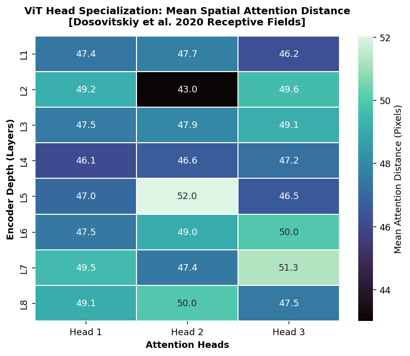
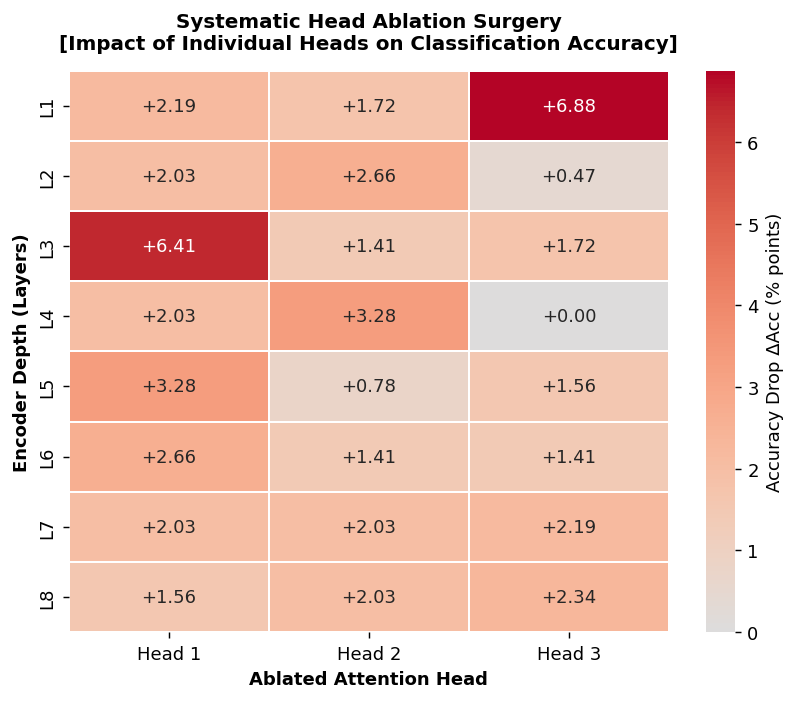
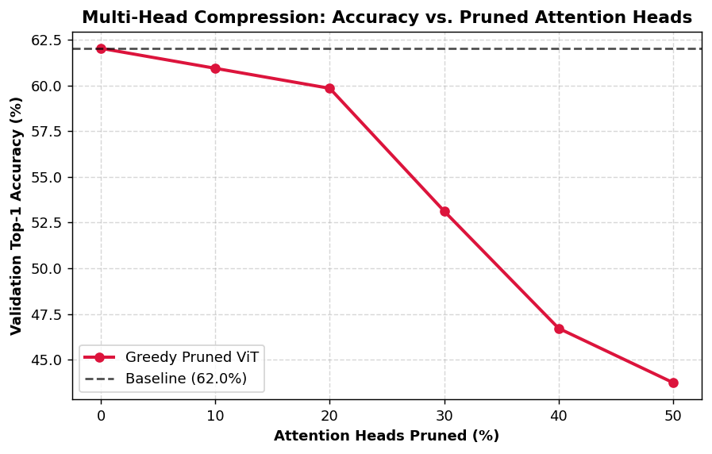
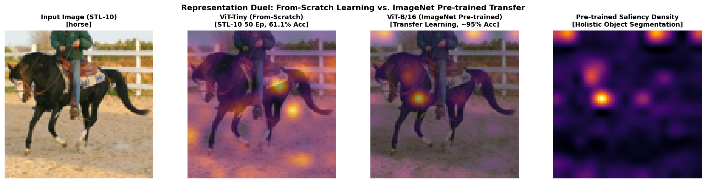
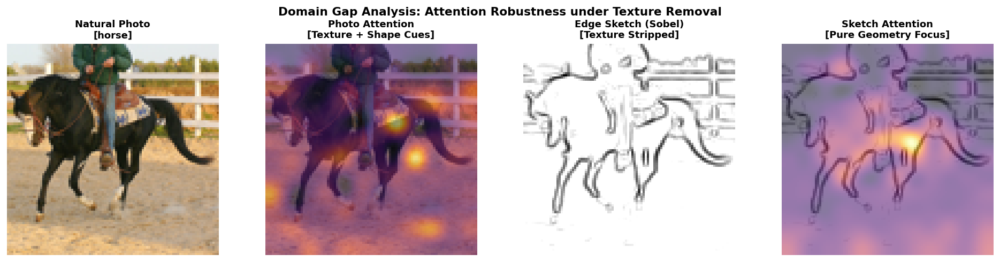

# vit-under-the-hood

A PyTorch implementation of the Vision Transformer (ViT) architecture built from scratch, along with tools to visualize and inspect what self-attention is learning during training.

---
## Overview

The purpose of this repository is to implement ViT from scratch, compare **from-scratch training vs. transfer learning (fine-tuning)** on STL-10, and run experiments on the learned attention patterns:

- **From-Scratch vs. Transfer Learning**: Training a custom lightweight ViT from scratch and comparing its representations against an ImageNet fine-tuned model.
- **Attention Timelapse**: Extracting attention maps across training epochs to see how the model transitions from random noise to focusing on relevant object regions.
- **Head Specialization & Ablation**: Analyzing whether different attention heads specialize in local vs. global features, and measuring the drop in accuracy when individual heads are disabled.
- **Photo vs. Sketch Generalization**: Testing how well the model handles simple edge sketches compared to natural photos to evaluate its reliance on texture vs. shape.

### Visual Attention Emergence Across Training (50 Epochs on STL-10)


*Attention Rollout ([Abnar & Zuidema, 2020](https://arxiv.org/abs/2005.00928)) tracked across 50 training epochs on STL-10. Attention transitions from diffuse edge noise (Epoch 1, 28.3% Val Acc) to sharp, localized semantic focus on the subject (Epoch 50, 60.9% Val Acc).*

---

### Empirical Findings & Interpretability (Phase 7)

#### 1. Receptive Field & Head Specialization

*Mean spatial attention distance in pixels across all 8 layers and 3 heads. Early heads (e.g. L2-H2: 43.0 px) behave like localized convolutional receptive fields, whereas deeper heads (L5-H2: 52.0 px, L7-H3: 51.3 px) attend globally across the entire $96 \times 96$ canvas.*

#### 2. Systematic Head Ablation Surgery & Multi-Head Pruning
| Single-Head Ablation Impact ($\Delta \text{Acc}$) | Greedy Pruning Retention Curve |
| :---: | :---: |
|  |  |

*Left: Drop in Top-1 accuracy ($\Delta \text{Acc}$) when disabling individual attention heads (Baseline: 62.03%). Two mission-critical heads emerge: **L1-H3** (+6.88% drop) and **L3-H1** (+6.41% drop), whereas **L4-H3** exhibits 0.00% impact. Right: Greedy pruning shows that up to **20% of heads (5/24)** can be pruned with minimal degradation (<2.2% loss).*

#### 3. Representation Duel: From-Scratch ViT vs. ImageNet Pre-trained ViT

*Attention rollout comparison on an unseen STL-10 test sample. The from-scratch ViT-Tiny (3.63M params, 61.1% Acc) disperses attention across high-contrast texture patches, whereas the pre-trained ViT-B/16 (86M params, ~95% Acc) achieves holistic anatomical segmentation of the subject.*

#### 4. Domain Gap & Texture vs. Shape Bias

*Domain shift evaluation via Sobel edge sketches. Stripping texture and color drops accuracy from **60.62%** to **16.88%** (**Shape Retention Index: 27.8%**), demonstrating the from-scratch model's strong reliance on surface textures.*

---

## Project Structure

```text
├── configs/              # Model and training YAML configurations
├── src/
│   ├── models/           # Patch embedding, Multi-Head Attention, and ViT modules
│   ├── training/         # DataLoaders, trainer loops, and checkpoint hooks
│   ├── experiments/      # Standalone scripts for the 3 attention experiments
│   └── utils/            # Attention rollout algorithms and visualization tools
├── notebooks/            # Exploratory and Google Colab training notebooks
├── tests/                # Unit tests for tensor shapes and attention properties
├── requirements.txt      # Project dependencies
└── README.md
```

---

## Getting Started

### Installation
```bash
git clone https://github.com/diallo-aliou/vit-under-the-hood.git
cd vit-under-the-hood
pip install -r requirements.txt
pip install -e .
```

### Training & Visual Exploration (Google Colab / Local GPU)
```bash
# Train ViT-Tiny on STL-10 (AdamW + Cosine Warmup, 50 epochs)
python train.py --config configs/vit_tiny_stl10.yaml --device cuda

# Interactive Colab walkthrough: notebooks/01_train_stl10_colab.ipynb
```

### Attention Rollout & Dynamics Timelapse
```bash
# Generate 50-epoch attention evolution GIF & progression strip across saved snapshots
python -m src.experiments.timelapse --checkpoints outputs/checkpoints --output outputs/timelapse_attention.gif

# Interactive Rollout & Timelapse notebook: notebooks/02_attention_timelapse.ipynb
```

### Head Specialization, Transfer Learning & Domain Gap
```bash
# Interactive Head Surgery, ImageNet Transfer & Texture Bias notebook: notebooks/03_head_specialization_and_transfer.ipynb
```

### 🔬 Interactive Explorer (Gradio)
```bash
# Launch the interactive web interface locally
python app.py

# Or from Google Colab (generates a public share link):
# demo.launch(share=True)
```
5 interactive tabs: **Attention Rollout Explorer** · **Head Surgery Lab** · **Representation Duel** · **Texture vs. Shape Bias** · **Model Architecture Card**

---

## Roadmap

- [x] **Phase 1**: Project setup & architecture design
- [x] **Phase 2**: Patch Embedding & Positional Encodings
- [x] **Phase 3**: Multi-Head Self-Attention from scratch
- [x] **Phase 4**: Full ViT model assembly & validation tests
- [x] **Phase 5**: Training pipeline, visual exploration & Google Colab acceleration
- [x] **Phase 6**: Attention Rollout & Timelapse generation
- [x] **Phase 7**: Head specialization, Transfer Learning & Domain Gap analysis
- [x] **Phase 8**: Interactive Gradio visualization interface & results write-up

